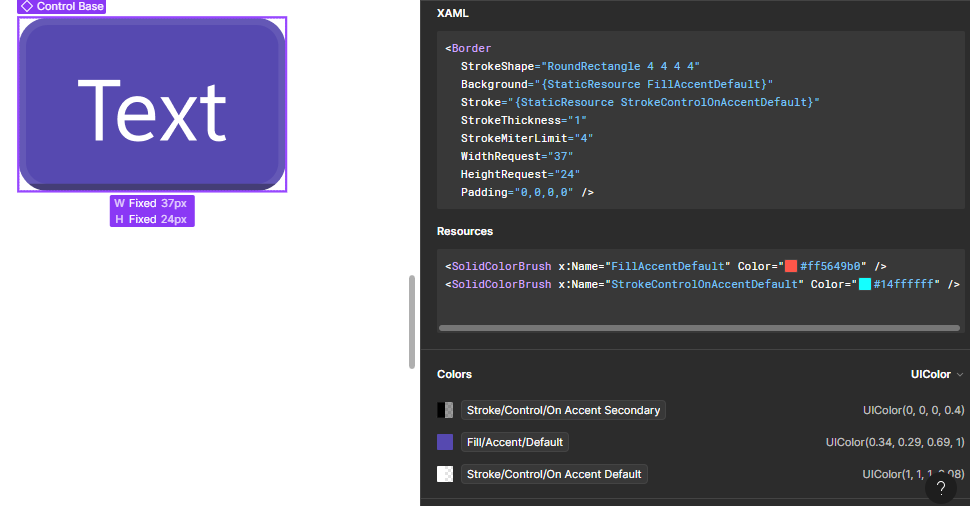
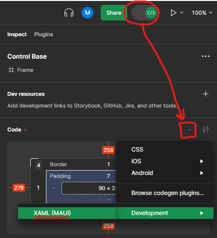

# MAUI Figma Codegen Plugin

A simple proof-of-concept Figma CodeGen plugin that gives you ready-to-use XAML for MAUI

## Install

This plugin is written in TypeScript

* Make sure TypeScript is installed
  - Install Node.js
  - Install Typescript: `npm install -g typescript`
* Make sure you're in the directory of this plugin
* Install the packages: 
  - `npm install`
* Run the Typescript compiler:
  - `tsc`
* Open Figma
* Titlebar menu -> Plugins -> Manage Plugins...
* Import Plugin from Manifest -> Select `manifest.json`
* Switch to "Dev Mode", and in the "Code" sidebar select "Development > XAML (MAUI)"

## Features

This plugin supports codegen to XAML for the following "nodes":

* Automatic generation of `SolidColorBrush` resources for objects that have defined colors
* Frame -> Border
* Component -> Border
* Instance -> Border
* Text -> Label
* Rectangle -> Rectangle

### TODO

* Rearchitect code to make it easier to add types because it's currently a hacked together mess 🙂
  - Better "parsers" for each mixin (ie: `DimensionAndPositionMixin`, `MinimalFillsMixin`). This gets tricky because some XAML types have different named properties for the same thing ie: `Rectangle.Fill` and `Border.Background`
* Gradients
* Layouts (grids, stacks, alignment, etc)
* Effects (shadows, etc)
* Export to `ResourceDictionary`
* Export to `Style`